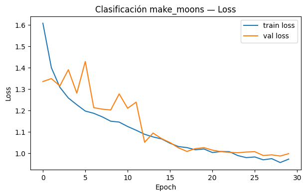
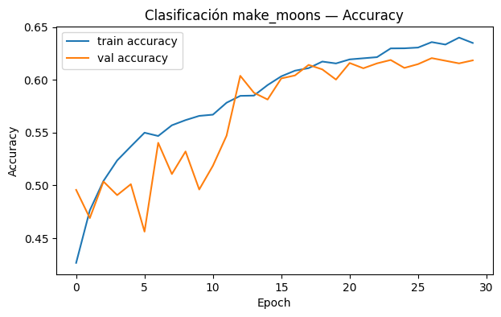
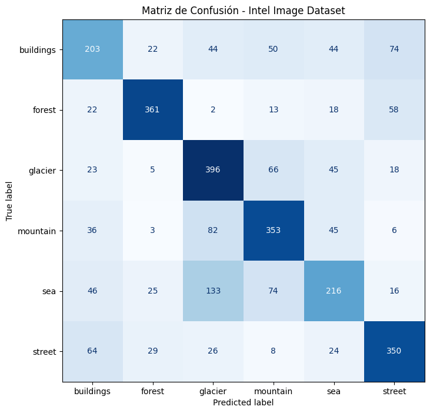

# RFC — Clasificación de Imágenes con Redes Fully-Connected

Ejercicio académico (Duoc UC) cuyo desafío explícito era clasificar imágenes **usando únicamente capas fully-connected (Dense)**, sin capas convolucionales. El objetivo no era maximizar accuracy a cualquier costo, sino explorar el **techo teórico** de una arquitectura densa en un problema de visión por computador, y entender por qué las CNN existen.

## Dataset

[Intel Image Classification](https://www.kaggle.com/datasets/puneet6060/intel-image-classification) (Kaggle) — ~14.000 imágenes de entrenamiento y 3.000 de test, distribuidas en 6 clases de paisajes: `buildings`, `forest`, `glacier`, `mountain`, `sea`, `street`.

## Arquitectura

Red feedforward (`Flatten` → `Dense` → `BatchNorm` → `Dropout`, x3) entrenada sobre imágenes de 64x64px:

- 3 bloques densos (516 → 256 → 128 unidades) con `ReLU`, `BatchNormalization` y `Dropout` decreciente (0.4 → 0.3 → 0.2)
- Salida `softmax` de 6 clases
- Optimizador `Adam` (lr=3e-4), `EarlyStopping` + `ReduceLROnPlateau` + `ModelCheckpoint`
- Data augmentation en entrenamiento (brillo, flip horizontal)

## Resultados (test set, 3.000 imágenes)

| Métrica | Valor |
|---|---|
| Accuracy | 62.6% |
| Precision (weighted) | 62.5% |
| Recall (weighted) | 62.6% |
| F1-score (weighted) | 62.3% |





## Conclusión

~63% de accuracy es consistente con el límite esperado para una arquitectura fully-connected en este problema: al aplanar la imagen (`Flatten`) se pierde toda la información espacial (vecindad de píxeles, bordes, texturas locales), que es precisamente lo que una capa convolucional preserva mediante sus filtros. La matriz de confusión lo confirma: las clases con mayor confusión son `sea` ↔ `glacier` y `buildings` ↔ `street`, pares que comparten patrones de color/textura global pero se diferencian por estructura espacial local — justo el tipo de información que este modelo no puede aprovechar.

Este ejercicio sirvió como punto de comparación antes de introducir capas convolucionales (CNN) en trabajos posteriores.

## Stack

Python, TensorFlow/Keras, scikit-learn (métricas), pandas, matplotlib, kagglehub.

## Cómo correrlo

```bash
pip install -r requirements.txt
jupyter notebook Red_FeedForward.ipynb
```

O directamente en [Google Colab](https://colab.research.google.com/drive/1WuKlci6wYtzAF9Z2Pb1uRGBUtzRu5XUT?usp=sharing).
